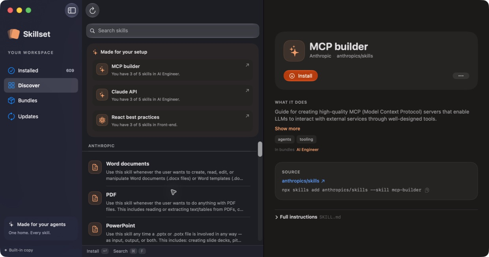
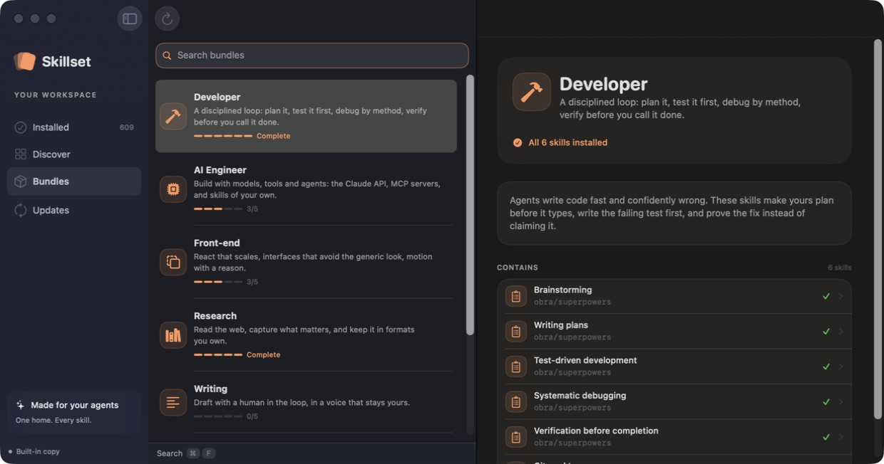
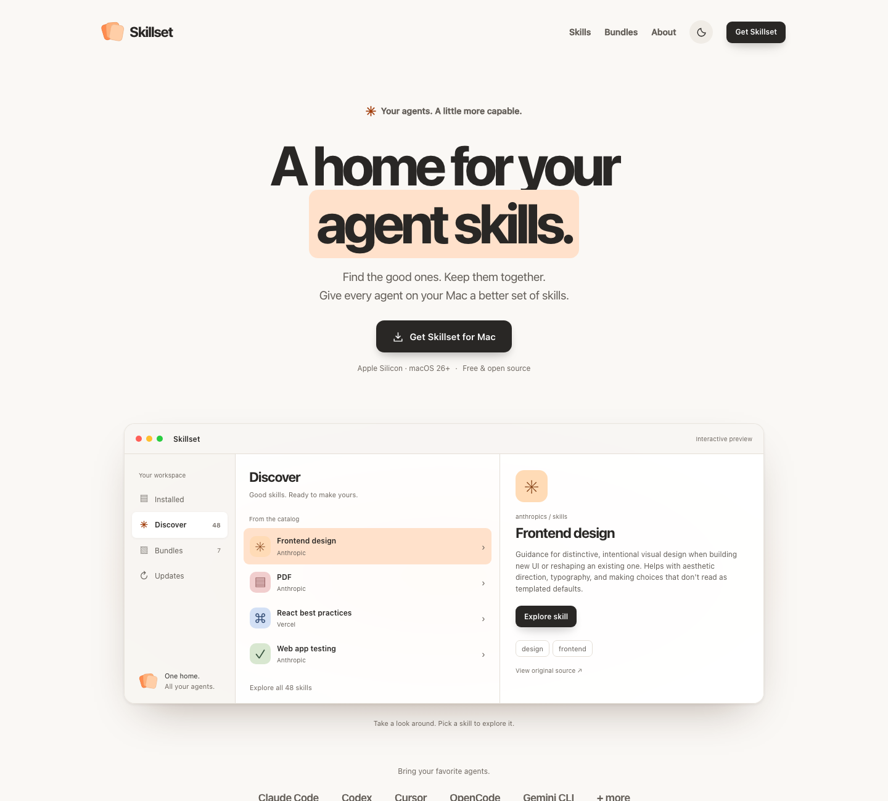

# Skillset

### A home for your agent skills.

Skillset is a native Mac app for finding, installing, and updating the skills your AI agents use.
See what is already on your Mac, discover something useful, and install a curated bundle in one action.

**[Mac beta releases](https://github.com/0xHamzaDev/Skillset/releases)** · [Installation](#install-the-beta) · [Build from source](#build-from-source)



**Apple Silicon · macOS 26+ · SwiftUI · Unsigned beta**

## What it does

- **See your setup.** Find installed skills across supported agents, with their source and location.
- **Find your next skill.** Browse the catalog and get local suggestions based on your skills and bundles.
- **Install a whole bundle.** Pick a collection for development, research, writing, and more.
- **Keep skills current.** Check the original source for updates. Removed skills go to the Trash.
- **Stay native.** Use keyboard shortcuts, system appearance, and light or dark mode.



## Install the beta

The beta is distributed directly through GitHub Releases. There is no Mac App Store installation.

1. Open [Releases](https://github.com/0xHamzaDev/Skillset/releases) and download `Skillset-0.1.0-arm64.zip`.
2. Extract the ZIP and move `Skillset.app` to Applications.
3. Open Skillset. If macOS blocks it and you trust this download, go to **System Settings → Privacy & Security → Open Anyway** for Skillset. Follow [Apple’s instructions](https://support.apple.com/en-us/102445).

> **Unsigned beta:** this build has an ad-hoc signature, without a Developer ID certificate or Apple notarization.
> macOS may block the first launch, and managed Macs may prevent an exception. Intel Macs are not supported by this download.

The release includes a checksum. From the folder containing both downloaded files, run:

```sh
shasum -a 256 -c Skillset-0.1.0-arm64.zip.sha256
```

## Your skills stay on your Mac

Skills remain ordinary folders containing `SKILL.md`. Skillset installs a shared copy into
`~/.agents/skills/<name>` and links it to agent folders that already exist. It records the source
in `~/.agents/.skill-lock.json`, using the same version 3 format as the `npx skills` CLI.

| Agent | Skill folder |
| --- | --- |
| Shared skills | `~/.agents/skills` |
| Claude Code | `~/.claude/skills` |
| Codex | `~/.codex/skills` |
| Cursor | `~/.cursor/skills` |
| OpenCode | `~/.config/opencode/skills` |
| Kiro | `~/.kiro/skills` |
| Copilot | `~/.copilot/skills` |
| Gemini CLI | `~/.gemini/skills` |

Claude Code plugin skills are visible as read-only. Downloads and update checks contact GitHub;
catalog refreshes contact the configured catalog URL. Recommendations are computed locally.
A bundled catalog is available when the online catalog cannot be reached.

## Browse on the web

The companion Astro website includes searchable skills, curated bundles, and an About page
with an original Riyadh skyline. Its install links open the selected skill or bundle in the Mac app.



## Build from source

### Mac app

Use macOS 26+ and Xcode with Swift 6.2 or newer. The Mac app has no third-party package dependencies.

```sh
git clone https://github.com/0xHamzaDev/Skillset.git
cd Skillset
make -C macos run
```

`make -C macos test` runs the Swift tests. `make -C macos dist` builds an ad-hoc-signed
`macos/Skillset-<version>.zip` for the current Mac’s architecture. The version is set in
[`macos/Support/Info.plist`](macos/Support/Info.plist).

### Website

Use Node.js 24 and pnpm 10.28.2. From the repository root:

```sh
pnpm install --frozen-lockfile
pnpm web
```

Open [localhost:4321](http://localhost:4321). To check and build the site:

```sh
pnpm typecheck
pnpm build
node site/scripts/check-build.mjs
```

### Project layout

| Directory | Contents |
| --- | --- |
| `macos/` | SwiftUI app, installer, discovery, and tests |
| `site/` | Astro website and catalog browser |
| `catalog/` | Shared catalog and refresh script |
| `docs/` | Screenshots and design specifications |

Both the app and website read [`catalog/catalog.json`](catalog/catalog.json). Run
`python3 catalog/refresh.py` to refresh skill descriptions from their upstream GitHub sources.

## Keyboard shortcuts

| Shortcut | Action |
| --- | --- |
| `⌘F` | Search |
| `⌘1` … `⌘4` | Installed, Discover, Bundles, Updates |
| `⌘R` | Rescan and check for updates |
| `⌘I` | Install or update the selected item |
| `⌘⌫` | Remove the selected skill while the list is focused |

## Beta limitations

Project-local skill folders are not scanned. Anonymous GitHub API limits can temporarily delay
update checks. The default online catalog may be unavailable before the website is deployed;
the bundled catalog works offline. Skillset manages skills, but does not audit their instructions
or guarantee the behavior of agents using them.

Created by [Hamza Alsherif](https://github.com/0xHamzaDev). Skills in the catalog belong to their
respective authors and retain their upstream licenses.
